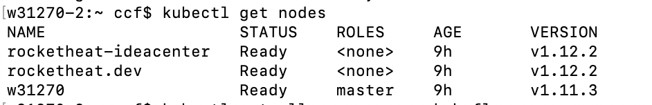
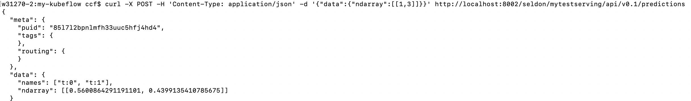

# Creating Kubernetes Cluster with Kubeadm and Using Ksonnet/Seldon to Serve Keras Machine Learning Algorithm on the Cluster, Monitor Model Perfomance with Seldon Analytics, and Distributed Train Models with Jupyter Hub.

The Final design of the cluster is as follow:


## The steps to build Kubernetes cluster:

### Cluster side
#### Master Node
1. Download Docker
2. Download Kubernetes
3. Download Kubeadm

#### Worker Node
1. Download Docker
2. Download Kubernetes
3. Download Kubeadm

### Client side
1. Download Docker
2. Download Kubernetes
3. Download Ksonnet
4. Download Kubeflow

### Download Docker
Follow the instructions here https://www.docker.com/get-started
When downloading Docker on Windows and Mac it will also download kubernetes

### Download Kubernetes
Follow the instructions here https://kubernetes.io/docs/getting-started-guides/ubuntu/

### Download Kubeadm
Follow the insturctions here https://kubernetes.io/docs/setup/independent/install-kubeadm/

### Download ksonnet
Follow the instructions here https://github.com/ksonnet/ksonnet

### Download Kubeflow
As detailed in the below instructions

# Starting Kubernetes Cluster

Swap memory needs to be off:
sudo swapoff -a

## Master Node:
After installing the appropriate installation you can run the following codes to download the appropriate software.

Run the following code:

```bash
sudo apt-get update \
  && sudo apt-get install -y \
  kubelet \
  kubeadm \
  kubernetes-cni
```

Figure out computer IP address to be used next:
```bash
ifconfig
```

```bash
sudo kubeadm init --pod-network-cidr=10.244.0.0/16 --apiserver-advertise-address=10.0.10.107 --kubernetes-version stable-1.12
```

Optional:
```bash
sudo useradd packet -G sudo -m -s /bin/bash
sudo passwd packet
```

The following codes makes sure you are utilizing the correct appropriate configuration files

```bash
cd $HOME
sudo whoami

sudo cp /etc/kubernetes/admin.conf $HOME/
sudo chown $(id -u):$(id -g) $HOME/admin.conf
export KUBECONFIG=$HOME/admin.conf

echo "export KUBECONFIG=$HOME/admin.conf" | tee -a ~/.bashrc
```

Apply your pod network (flannel)

```bash
kubectl apply -f https://raw.githubusercontent.com/coreos/flannel/master/Documentation/kube-flannel.yml
kubectl apply -f https://raw.githubusercontent.com/coreos/flannel/master/Documentation/k8s-manifests/kube-flannel-rbac.yml
```

## Worker Node:
Similarly to above download the appropriate software and run the following codes to double check all software are downloaded.

```bash
sudo apt-get update \
  && sudo apt-get install -y \
  kubelet \
  kubeadm \
  kubernetes-cni
```

Join the cluster with whatever Token provided above after running the kubeadm init...

example:
```bash
kubeadm join --token f2292a.77a85956eb6acbd6 10.100.195.129:6443 --discovery-token-ca-cert-hash sha256:0c4890b8d174078072545ef17f295a9badc5e2041dc68c419880cca93d084098
```

Viusalizing nodes:


#### Once the master and worker nodes are set there is not much additional to do on the above and the rest is just adding and configuring the containers on the cluster.

## Client or Master:
Run this code on either the master or the client node

### Obtain admin.conf info:
This will help you to use your computer instead of the master node to communicate with the cluster.
scp root@<master ip>:/etc/kubernetes/admin.conf .

```bash
scp root@10.0.10.107:/etc/kubernetes/admin.conf .
export KUBECONFIG=~/Documents/Kubernetes/my-kubeflow/admin.conf
```

You can use your computer instead of the master.

You will need ksonnet to help packaging your application.
To download run the following (Mac):

```bash
brew install ksonnet/tap/ks
```
for other operating systems check the following:
https://github.com/ksonnet/ksonnet

Run the following to download kubeflow to make it easier to utilize machine learning tools over the cluster. For further details check the following: https://github.com/katacoda/kubeflow-ksonnet

```bash
# Create a namespace for kubeflow deployment
NAMESPACE=kubeflow
kubectl create namespace ${NAMESPACE}

# Which version of Kubeflow to use
# For a list of releases refer to:
# https://github.com/kubeflow/kubeflow/releases
VERSION=v0.1.3

# Initialize a ksonnet app. Set the namespace for it's default environment.
APP_NAME=my-kubeflow
ks init ${APP_NAME} --api-spec=version:v1.11.3
cd ${APP_NAME}
ks env set default --namespace ${NAMESPACE}

# Install Kubeflow components
ks registry add kubeflow github.com/kubeflow/kubeflow/tree/${VERSION}/kubeflow

ks pkg install kubeflow/core@${VERSION}
ks pkg install kubeflow/tf-serving@${VERSION}
ks pkg install kubeflow/tf-job@${VERSION}

# Create templates for core components
ks generate kubeflow-core kubeflow-core

# If your cluster is running on Azure you will need to set the cloud parameter.
# If the cluster was created with AKS or ACS choose aks, it if was created
# with acs-engine, choose acsengine
# PLATFORM=<aks|acsengine>
# ks param set kubeflow-core cloud ${PLATFORM}

# Enable collection of anonymous usage metrics
# Skip this step if you don't want to enable collection.
ks param set kubeflow-core reportUsage true
ks param set kubeflow-core usageId $(uuidgen)

# Deploy Kubeflow
ks apply default -c kubeflow-core
```

Run the following codes to start jupyter hub

```bash
# To connect with jupyer hub locally
PODNAME=`kubectl get pods --namespace=${NAMESPACE} --selector="app=tf-hub" --output=template --template="{{with index .items 0}}{{.metadata.name}}{{end}}"`
kubectl port-forward --namespace=${NAMESPACE} $PODNAME 8000:8000
```
Visualizing Jupyter hub


To create the docker image you can use seldon wrapper using the ksonnet packaging system.

```bash
ks pkg install kubeflow/seldon
ks generate seldon seldon
ks apply default -c seldon --namespace Kubeflow
```

Visualizing cluster details:


Once you download seldon using ksonnet and through kubeflow you can build the docker image as follow (for further details check the following https://github.com/kubeflow/examples/tree/master/xgboost_ames_housing):
1. Create a folder with three files: prediction file, the saved keras model, and requirements file. An example here is the Example_Folder where testServing is the prediction file, test_model.h5 is the saved keras model, and requirements.txt is the python library requirements.
2. Build the image with the help of seldon (https://github.com/SeldonIO/seldon-core).
3. You have now an image that is ready to deploy on kubernetes.

For the testServing file you only need to load the model and and return the prediction as follow:

```python
from keras.models import load_model

class testServing(object): # The file is called MnistClassifier.py

    def __init__(self):
        # You can load your pre-trained model in here. The instance will be created once when the docker container starts running on the cluster.
        self.model = load_model('./test_model.h5')

    def predict(self,X,feature_names):
		 # X is a 2-dimensional numpy array, feature_names is a list of strings. This methods needs to return a numpy array of predictions.
        return self.model.predict(X)

```

To create the build folder in the Example_Folder run the following after adjusting the path and the name of the image:

```bash
docker run -v ~/Documents/Kubernetes/my-kubeflow/ModelServing:/my_model seldonio/core-python-wrapper:0.7 /my_model testServing 0.1 seldonio
```

then to build the model and push run the following (you would need to edit both files for appropriate nameing and pushing to dockerhub)

```bash
cd build
./build_image.sh
./push_image.sh
```

Once the image is pushed you need add it to your kubernetes cluster as follow

```bash
ks generate seldon-serve-simple testserving   \
                                --name=mytestserving   \
                                --image=rocketheat/testclassifier:0.5   \
                                --namespace=kubeflow   \
                                --replicas=1

ks apply default -c testserving --namespace kubeflow
```
Once the container is up and running you can test it as follow:
First run forward it locally with
```bash
kubectl port-forward $(kubectl get pods -n ${NAMESPACE} -l service=ambassador -o jsonpath='{.items[0].metadata.name}') -n ${NAMESPACE} 8080:80
```
or
```bash
kubectl port-forward $(kubectl get pods -n kubeflow -l service=ambassador -o jsonpath='{.items[0].metadata.name}') -n kubeflow 8002:80
```
Then you can test the api as follow:
Can be used on kubernetes
```bash
curl -X POST -H 'Content-Type: application/json' -d '{"data":{"ndarray":[[1,3]]}}' http://localhost:8002/seldon/mytestserving/api/v0.1/predictions
```
If you run the api as simple docker container you can use the following
```bash
curl -H "Content-Type: application/x-www-form-urlencoded" -d 'json={"data":{"tensor":{"shape":[1,2],"values":[1,3]}}}' http://localhost:8002/seldon/mytestserving/api/v0.1/predictions
```

Example Query


## Seldon-Core Analytics
There is a powerful seldon core analytics that you can use to monitor perfomance of all models, cluster, memory....

You will need to download helm. You can get more details here: https://github.com/helm/helm

``bash
brew install kubernetes-helm
```

To download the dashboard you can follow the information here (https://github.com/SeldonIO/seldon-core/blob/master/docs/analytics.md):

```bash
helm install seldon-core-analytics --name seldon-core-analytics \
     --repo https://storage.googleapis.com/seldon-charts \
     --set grafana_prom_admin_password=password \
     --set persistence.enabled=false \
```
and to run locally
```bash
kubectl port-forward $(kubectl get pods -l app=grafana-prom-server -o jsonpath='{.items[0].metadata.name}') 3000:3000
```
Link:
http://localhost:3000/dashboard/db/prediction-analytics?refresh=5s&orgId=1

Username admin, and password password


#### Additional helper codes:
unbind port already in use
```bash
lsof -ti:8002 | xargs kill -9
```
